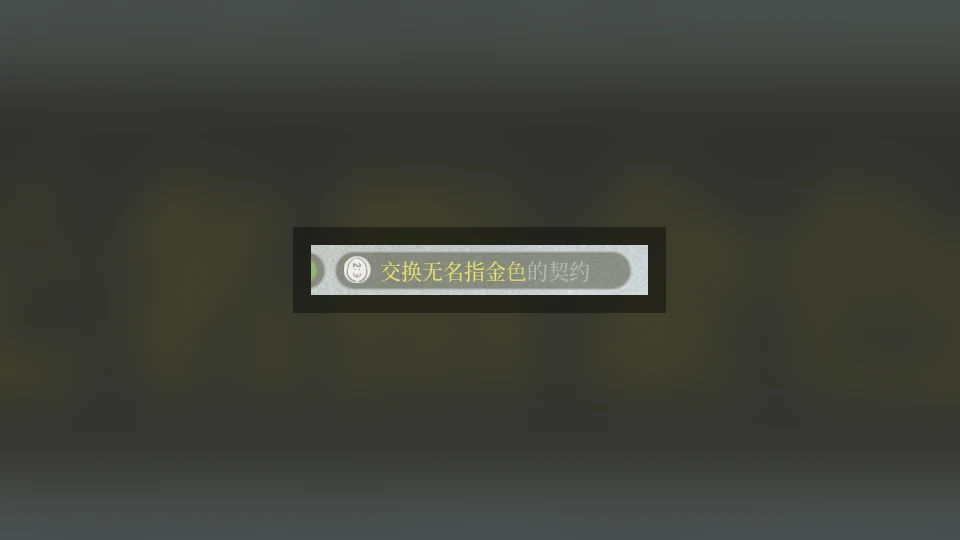
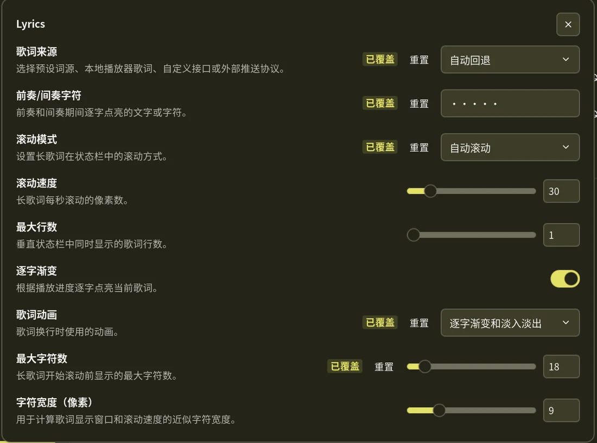

# Noctalia Lyrics

Synchronized lyrics for the Noctalia status bar, with album artwork, karaoke
highlighting, animated line changes, smooth long-line scrolling, and multiple
lyric sources.



This repository is the primary development source for the plugin. Stable
versions are submitted to
[noctalia-dev/community-plugins](https://github.com/noctalia-dev/community-plugins)
under the plugin ID `h465855hgg/lyrics`.

## Features

- Bar widget for the current lyric line and circular album artwork.
- Headless service that reads the active MPRIS player via `playerctl`.
- Per-character karaoke highlighting for dynamic lyrics.
- Line transition modes: karaoke, cascade, wave, fade, or no animation.
- Smooth marquee scrolling for long lyric lines, with a pause at each edge.
- Configurable intro/interlude cue text such as `•••••`.
- Track fallback display when synchronized lyrics are unavailable.
- Right-click pause/resume; paused lyrics dim and animations stop.
- External IPC protocol for players or scripts that already know the lyrics.

## Screenshots

Status-bar widget:


Plugin settings:



## Requirements

Install these commands on `PATH`:

- `playerctl`: MPRIS metadata, playback position, and play/pause control.
- `python3`: LRCLIB helper and KRC/dynamic-lyric parser.
- `curl`: public NetEase API requests.
- `cp`: preserves temporary local album-art files in the plugin cache.

Your media player must expose MPRIS metadata for automatic track detection.

To check or install the runtime packages automatically, run:

```sh
sh scripts/setup-deps.sh --check
sh scripts/setup-deps.sh
```

Use `--yes` for unattended installs. The script supports `apt`, `dnf`,
`pacman`, `zypper`, `apk`, and `xbps-install`. It installs only system runtime
packages; it does not modify Noctalia settings.

## Installation

After the plugin is accepted into the Noctalia community catalog, enable
`h465855hgg/lyrics` from Noctalia's plugin settings and add the `lyrics` widget
to your bar. The catalog installs the plugin files; system packages are still
installed by your distribution package manager or by `scripts/setup-deps.sh`.

For development or early testing, clone this repository and add the clone as a
local plugin source in Noctalia. The repository root is the plugin root; it
contains `plugin.toml` directly.

```sh
git clone https://github.com/h465855hgg/noctalia-lyrics.git
```

Then enable plugin ID `h465855hgg/lyrics`, start the `service` entry, and add the
`lyrics` bar widget.

## Usage

The background service detects the active MPRIS player, fetches lyrics, caches
album artwork under `.cache/`, and publishes state to the widget.

Left-click the widget to switch between lyric mode and track-info mode.
Right-click the widget to pause or resume the active player.

When synchronized lyrics are unavailable, the widget displays the track title
and artist. Long lines scroll smoothly. Long intro and instrumental gaps can
show a configurable cue string.

## Lyric Sources

The `lyrics_source` setting controls lookup behavior:

| Value | Behavior |
| --- | --- |
| `auto` | Try LRCLIB first, then the public NetEase Music API. |
| `lrclib` | Use LRCLIB only. |
| `netease` | Use the public NetEase Music API only. |
| `mpris` | Read embedded text lyrics from the active MPRIS player. |
| `custom` | Request a configured HTTP endpoint. |
| `external` | Wait for lyrics pushed through Noctalia IPC. |

The plugin does not read browser cookies, player credentials, or private API
tokens.

## Custom HTTP Source

Set `lyrics_source` to `custom`, then configure `custom_url`. The URL supports
these placeholders, which are URL-encoded before the request is sent:

- `{title}`
- `{artist}`
- `{album}`
- `{duration}`

The response can be plain LRC text or JSON. For JSON responses, set
`custom_json_field` to the dotted field path containing the LRC string or a
timed `lines` array, for example `data.syncedLyrics`.

## External IPC

Set `lyrics_source` to `external` to let another program push lyrics into the
plugin service.

```sh
noctalia msg plugin h465855hgg/lyrics:service all <event> '<payload>'
```

Supported events:

- `push-lrc`: payload is synchronized or plain LRC text.
- `push-json`: payload is JSON with a `lines` timed array or a `lyrics` LRC string.
- `push-state`: payload can also update `track`, `position`, `playing`, and `cover`.
- `clear`: clears the currently published lyrics.

Line timestamps and per-character timestamps are milliseconds. MPRIS track
duration and playback position are microseconds.

```json
{
  "lines": [
    {
      "time": 1200,
      "duration": 1800,
      "text": "Hello",
      "chars": [1200, 1500, 1800, 2100, 2400]
    }
  ]
}
```

Full state example:

```json
{
  "track": {
    "title": "Song",
    "artist": "Artist",
    "album": "Album",
    "duration": 180000000
  },
  "position": 42500000,
  "playing": true,
  "cover": "/absolute/path/cover.jpg",
  "lines": [
    {
      "time": 42000,
      "duration": 2000,
      "text": "Current lyric",
      "chars": [42000, 42400, 42800, 43200]
    }
  ]
}
```

## Settings

| Setting | Type | Default | Description |
| --- | --- | --- | --- |
| `lyrics_source` | `select` | `auto` | Select automatic fallback, LRCLIB, public NetEase, MPRIS, custom HTTP, or external IPC. |
| `custom_url` | `string` | empty | HTTP URL template with `{title}`, `{artist}`, `{album}`, and `{duration}` placeholders. |
| `custom_json_field` | `string` | `syncedLyrics` | Dotted JSON path containing LRC text or a timed `lines` array. |
| `cue_text` | `string` | `•••••` | Characters shown during intro and interlude gaps. |
| `scroll_mode` | `select` | `auto` | Automatic marquee, forced marquee, or static truncation. |
| `marquee_speed` | `int` | `30` | Approximate long-line scroll speed in logical pixels per second. |
| `max_lines` | `int` | `1` | Number of lyric lines shown on a vertical bar, from 1 to 3. |
| `gradient` | `bool` | `true` | Enable progressive per-character highlighting. |
| `animation` | `select` | `karaoke` | Line transition mode: karaoke, cascade, wave, fade, or none. |
| `max_chars` | `int` | `24` | Visible Unicode characters before marquee scrolling starts. |
| `char_width` | `int` | `9` | Estimated logical-pixel character width for scrolling and layout. |
| `glyph` | `glyph` | `music` | Fallback icon shown when album artwork is unavailable. |
| `show_artist` | `bool` | `true` | Include the artist in track-info mode. |
| `hide_when_paused` | `bool` | `false` | Hide the widget instead of dimming it while paused. |
| `show_cover` | `bool` | `true` | Show circular album artwork beside the lyrics. |
| `active_color` | `color` | `primary` | Color for the current and already-sung lyric characters. |
| `inactive_color` | `color` | `on_surface_variant` | Color for upcoming lyrics, paused playback, and secondary lines. |

## Development

Run the local validator before opening a pull request:

```sh
python3 tools/validate.py
python3 -m py_compile krc_decode.py lrclib_lyric.py tools/validate.py
```

Runtime files are intentionally ignored by Git:

- `.cache/`
- `.query_cache.tmp`
- `.krc_cache.tmp`
- `cover_*.jpg`
- Python bytecode caches

This keeps the repository clean while allowing the plugin to cache album art and
temporary lyric-query files during normal use.

## Contributing

Pull requests should target this repository first. Keep changes focused, run the
validator, and do not include credentials, cookies, private API tokens, or large
runtime cache files.

For community catalog updates, sync stable changes from this repository to
`noctalia-dev/community-plugins` while keeping the same plugin ID:
`h465855hgg/lyrics`.

## License

MIT. See [LICENSE](LICENSE).
